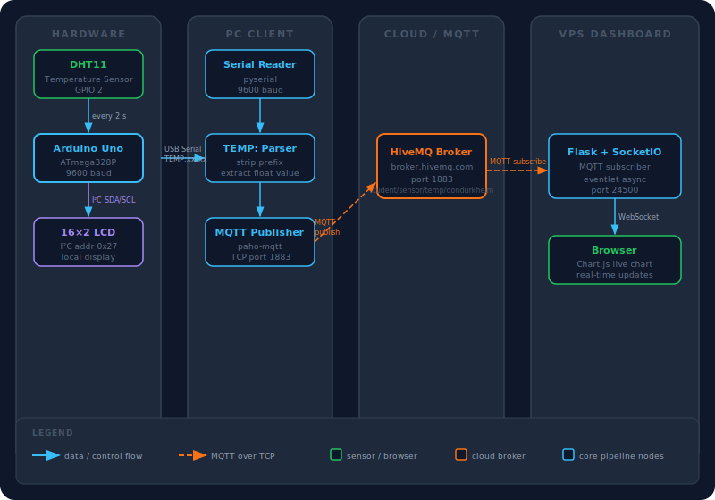
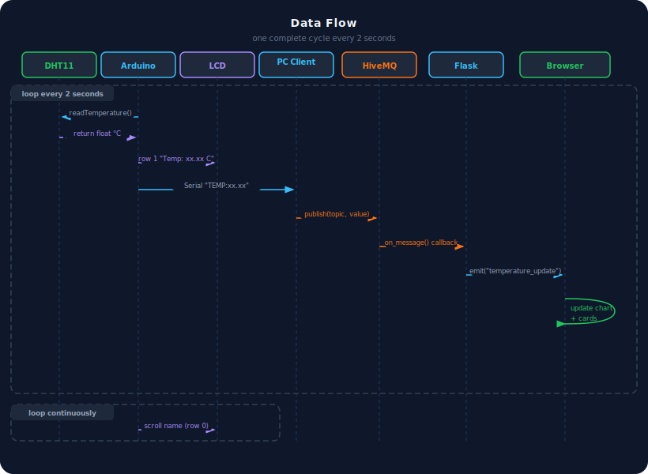

<div align="center">

# 🌡️ IoT Temperature Monitor

**Real-time temperature sensing, local LCD display, and live web dashboard via MQTT**

[](https://www.arduino.cc/)
[](https://www.python.org/)
[](https://flask-socketio.readthedocs.io/)
[](https://www.hivemq.com/)
[](LICENSE)

*made with ♥ by Don Durkheim*

</div>

---

## Overview

An end-to-end IoT pipeline: a DHT11 sensor on an Arduino Uno reads temperature every 2 seconds, shows it on a 16×2 I²C LCD, streams it over USB serial to a Python client, which publishes to MQTT. A Flask + SocketIO dashboard on a VPS subscribes and pushes readings live to a browser chart.

---

## System Architecture

<div align="center">



</div>

---

## Data Flow

<div align="center">



</div>

---

## Project Structure

```
.
├── arduino/
│   └── temp_display.ino       # Sensor + LCD + serial output
├── pc_client/
│   └── pc_client.py           # Serial reader + MQTT publisher
├── dashboard/
│   ├── app.py                 # Flask + SocketIO + MQTT subscriber
│   └── templates/
│       └── index.html         # Live dashboard UI
└── README.md
```

---

## Hardware

| Component | Detail |
|-----------|--------|
| Microcontroller | Arduino Uno |
| Sensor | DHT11 — data on **GPIO 2** |
| Display | 16×2 LCD, I²C address `0x27` |
| Bus | USB Serial @ 9600 baud |

### Wiring

```
DHT11  DATA → Arduino D2      LCD SDA → Arduino A4
DHT11  VCC  → 5V              LCD SCL → Arduino A5
DHT11  GND  → GND             LCD VCC → 5V
                               LCD GND → GND
```

---

## Getting Started

### 1 — Arduino

Install via Arduino Library Manager: `DHT sensor library`, `LiquidCrystal_I2C`, `Wire`.

Flash `arduino/temp_display.ino`. Update the name if needed:

```cpp
String candidateName = "Cyubahiro Don Durkheim";
```

### 2 — PC Client

```bash
pip install pyserial paho-mqtt
python pc_client/pc_client.py
```

Auto-detects the Arduino port. To pin a specific port:

```python
COM_PORT = "/dev/ttyACM0"  # Linux
COM_PORT = "COM3"           # Windows
```

### 3 — Dashboard (VPS)

```bash
pip install flask flask-socketio eventlet paho-mqtt
python dashboard/app.py
```

Keep it running after disconnect:

```bash
nohup python3 dashboard/app.py > dashboard.log 2>&1 &
```

Then open **`http://157.173.101.159:24500`** in a browser.

---

## Configuration

| Variable | Default | Description |
|----------|---------|-------------|
| `COM_PORT` | `None` | Serial port — `None` = auto-detect |
| `BAUD_RATE` | `9600` | Must match Arduino sketch |
| `MQTT_BROKER` | `broker.hivemq.com` | HiveMQ public broker |
| `MQTT_PORT` | `1883` | Standard MQTT port |
| `MQTT_TOPIC` | `student/sensor/temperature/dondurkheim` | Unique per-student topic |
| Dashboard port | `24500` | Flask app port on VPS |

---

## Serial Protocol

```
TEMP:25.60
```

Arduino emits one line per reading. The PC client filters for `TEMP:` prefix, strips it, and publishes the numeric value to MQTT. Any other serial output is printed as debug.

---

## LCD Layout

```
┌────────────────┐
│ Cyubahiro Don  │  ← candidate name (scrolls every 300ms if > 16 chars)
│ Temp: 25.60 C  │  ← live temperature updated every 2s
└────────────────┘
```

---

## License

MIT © Cyubahiro Don Durkheim
