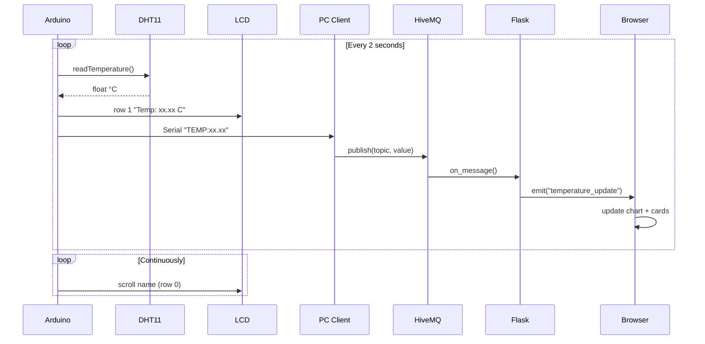

<div align="center">

# 🌡️ IoT Temperature Monitor

**Real-time temperature sensing, local LCD display, and live web dashboard via MQTT**

[](https://www.arduino.cc/)
[](https://www.python.org/)
[](https://flask-socketio.readthedocs.io/)
[](https://www.hivemq.com/)
[](LICENSE)

*made with ♥ by Don Durkheim*

</div>

---

## Overview

An end-to-end IoT pipeline: a DHT11 sensor on an Arduino Uno reads temperature every 2 seconds, shows it on a 16×2 I²C LCD, streams it over USB serial to a Python client, which publishes to MQTT. A Flask + SocketIO dashboard on a VPS subscribes and pushes readings live to a browser chart.

---

## System Architecture

<div align="center">
<svg xmlns="http://www.w3.org/2000/svg" viewBox="0 0 780 540" width="780" height="540" style="max-width:100%">
  <defs>
    <marker id="arr" markerWidth="8" markerHeight="8" refX="7" refY="3" orient="auto">
      <path d="M0,0 L0,6 L8,3 z" fill="#38bdf8"/>
    </marker>
    <filter id="glow">
      <feGaussianBlur stdDeviation="2" result="blur"/>
      <feMerge><feMergeNode in="blur"/><feMergeNode in="SourceGraphic"/></feMerge>
    </filter>
  </defs>

  <!-- Background -->
  <rect width="780" height="540" rx="16" fill="#0f172a"/>

  <!-- ── COLUMN 1: Hardware ─────────────────────────────── -->
  <!-- Group box -->
  <rect x="20" y="20" width="160" height="500" rx="12" fill="#1e293b" stroke="#334155" stroke-width="1.5"/>
  <text x="100" y="44" text-anchor="middle" font-family="Segoe UI,Arial,sans-serif" font-size="11" font-weight="700" fill="#64748b" letter-spacing="1">🔧 HARDWARE</text>

  <!-- DHT11 -->
  <rect x="40" y="60" width="120" height="52" rx="8" fill="#0f172a" stroke="#22c55e" stroke-width="1.5"/>
  <text x="100" y="81" text-anchor="middle" font-family="Segoe UI,Arial,sans-serif" font-size="10" font-weight="700" fill="#22c55e">DHT11</text>
  <text x="100" y="96" text-anchor="middle" font-family="Segoe UI,Arial,sans-serif" font-size="9" fill="#64748b">Temp Sensor</text>
  <text x="100" y="108" text-anchor="middle" font-family="Segoe UI,Arial,sans-serif" font-size="9" fill="#64748b">GPIO 2</text>

  <!-- Arrow DHT11 → Arduino -->
  <line x1="100" y1="112" x2="100" y2="146" stroke="#38bdf8" stroke-width="1.5" marker-end="url(#arr)"/>
  <text x="104" y="133" font-family="Segoe UI,Arial,sans-serif" font-size="8" fill="#94a3b8">every 2s</text>

  <!-- Arduino Uno -->
  <rect x="40" y="148" width="120" height="52" rx="8" fill="#0f172a" stroke="#38bdf8" stroke-width="2" filter="url(#glow)"/>
  <text x="100" y="169" text-anchor="middle" font-family="Segoe UI,Arial,sans-serif" font-size="10" font-weight="700" fill="#38bdf8">Arduino Uno</text>
  <text x="100" y="184" text-anchor="middle" font-family="Segoe UI,Arial,sans-serif" font-size="9" fill="#64748b">ATmega328P</text>
  <text x="100" y="196" text-anchor="middle" font-family="Segoe UI,Arial,sans-serif" font-size="9" fill="#64748b">9600 baud</text>

  <!-- Arrow Arduino → LCD -->
  <line x1="100" y1="200" x2="100" y2="234" stroke="#38bdf8" stroke-width="1.5" marker-end="url(#arr)"/>
  <text x="104" y="221" font-family="Segoe UI,Arial,sans-serif" font-size="8" fill="#94a3b8">I²C SDA/SCL</text>

  <!-- LCD -->
  <rect x="40" y="236" width="120" height="52" rx="8" fill="#0f172a" stroke="#a78bfa" stroke-width="1.5"/>
  <text x="100" y="257" text-anchor="middle" font-family="Segoe UI,Arial,sans-serif" font-size="10" font-weight="700" fill="#a78bfa">16×2 LCD</text>
  <text x="100" y="272" text-anchor="middle" font-family="Segoe UI,Arial,sans-serif" font-size="9" fill="#64748b">I²C addr 0x27</text>
  <text x="100" y="284" text-anchor="middle" font-family="Segoe UI,Arial,sans-serif" font-size="9" fill="#64748b">local display</text>

  <!-- ── COLUMN 2: PC Client ───────────────────────────── -->
  <rect x="210" y="20" width="160" height="500" rx="12" fill="#1e293b" stroke="#334155" stroke-width="1.5"/>
  <text x="290" y="44" text-anchor="middle" font-family="Segoe UI,Arial,sans-serif" font-size="11" font-weight="700" fill="#64748b" letter-spacing="1">💻 PC CLIENT</text>

  <!-- Serial Reader -->
  <rect x="230" y="60" width="120" height="52" rx="8" fill="#0f172a" stroke="#38bdf8" stroke-width="1.5"/>
  <text x="290" y="81" text-anchor="middle" font-family="Segoe UI,Arial,sans-serif" font-size="10" font-weight="700" fill="#38bdf8">Serial Reader</text>
  <text x="290" y="96" text-anchor="middle" font-family="Segoe UI,Arial,sans-serif" font-size="9" fill="#64748b">pyserial</text>
  <text x="290" y="108" text-anchor="middle" font-family="Segoe UI,Arial,sans-serif" font-size="9" fill="#64748b">9600 baud</text>

  <!-- Arrow Serial → Parser -->
  <line x1="290" y1="112" x2="290" y2="146" stroke="#38bdf8" stroke-width="1.5" marker-end="url(#arr)"/>

  <!-- Parser -->
  <rect x="230" y="148" width="120" height="52" rx="8" fill="#0f172a" stroke="#38bdf8" stroke-width="1.5"/>
  <text x="290" y="169" text-anchor="middle" font-family="Segoe UI,Arial,sans-serif" font-size="10" font-weight="700" fill="#38bdf8">TEMP: Parser</text>
  <text x="290" y="184" text-anchor="middle" font-family="Segoe UI,Arial,sans-serif" font-size="9" fill="#64748b">strip prefix</text>
  <text x="290" y="196" text-anchor="middle" font-family="Segoe UI,Arial,sans-serif" font-size="9" fill="#64748b">→ float value</text>

  <!-- Arrow Parser → Publisher -->
  <line x1="290" y1="200" x2="290" y2="234" stroke="#38bdf8" stroke-width="1.5" marker-end="url(#arr)"/>

  <!-- MQTT Publisher -->
  <rect x="230" y="236" width="120" height="52" rx="8" fill="#0f172a" stroke="#38bdf8" stroke-width="1.5"/>
  <text x="290" y="257" text-anchor="middle" font-family="Segoe UI,Arial,sans-serif" font-size="10" font-weight="700" fill="#38bdf8">MQTT Publisher</text>
  <text x="290" y="272" text-anchor="middle" font-family="Segoe UI,Arial,sans-serif" font-size="9" fill="#64748b">paho-mqtt</text>
  <text x="290" y="284" text-anchor="middle" font-family="Segoe UI,Arial,sans-serif" font-size="9" fill="#64748b">TCP 1883</text>

  <!-- ── COLUMN 3: Cloud ───────────────────────────────── -->
  <rect x="400" y="20" width="160" height="500" rx="12" fill="#1e293b" stroke="#334155" stroke-width="1.5"/>
  <text x="480" y="44" text-anchor="middle" font-family="Segoe UI,Arial,sans-serif" font-size="11" font-weight="700" fill="#64748b" letter-spacing="1">☁️ CLOUD / MQTT</text>

  <!-- HiveMQ Broker -->
  <rect x="420" y="148" width="120" height="68" rx="8" fill="#0f172a" stroke="#f97316" stroke-width="1.5" filter="url(#glow)"/>
  <text x="480" y="172" text-anchor="middle" font-family="Segoe UI,Arial,sans-serif" font-size="10" font-weight="700" fill="#f97316">HiveMQ</text>
  <text x="480" y="187" text-anchor="middle" font-family="Segoe UI,Arial,sans-serif" font-size="9" fill="#64748b">broker.hivemq.com</text>
  <text x="480" y="200" text-anchor="middle" font-family="Segoe UI,Arial,sans-serif" font-size="9" fill="#64748b">port 1883</text>
  <text x="480" y="213" text-anchor="middle" font-family="Segoe UI,Arial,sans-serif" font-size="8" fill="#475569">student/sensor/temp</text>

  <!-- ── COLUMN 4: VPS Dashboard ──────────────────────── -->
  <rect x="590" y="20" width="170" height="500" rx="12" fill="#1e293b" stroke="#334155" stroke-width="1.5"/>
  <text x="675" y="44" text-anchor="middle" font-family="Segoe UI,Arial,sans-serif" font-size="11" font-weight="700" fill="#64748b" letter-spacing="1">🖥️ VPS DASHBOARD</text>

  <!-- Flask + SocketIO -->
  <rect x="610" y="148" width="130" height="68" rx="8" fill="#0f172a" stroke="#38bdf8" stroke-width="1.5"/>
  <text x="675" y="172" text-anchor="middle" font-family="Segoe UI,Arial,sans-serif" font-size="10" font-weight="700" fill="#38bdf8">Flask + SocketIO</text>
  <text x="675" y="187" text-anchor="middle" font-family="Segoe UI,Arial,sans-serif" font-size="9" fill="#64748b">MQTT subscriber</text>
  <text x="675" y="200" text-anchor="middle" font-family="Segoe UI,Arial,sans-serif" font-size="9" fill="#64748b">eventlet async</text>
  <text x="675" y="213" text-anchor="middle" font-family="Segoe UI,Arial,sans-serif" font-size="9" fill="#64748b">port 24500</text>

  <!-- Arrow Flask → Browser -->
  <line x1="675" y1="216" x2="675" y2="258" stroke="#38bdf8" stroke-width="1.5" marker-end="url(#arr)"/>
  <text x="679" y="241" font-family="Segoe UI,Arial,sans-serif" font-size="8" fill="#94a3b8">WebSocket</text>

  <!-- Browser -->
  <rect x="610" y="260" width="130" height="52" rx="8" fill="#0f172a" stroke="#22c55e" stroke-width="1.5"/>
  <text x="675" y="281" text-anchor="middle" font-family="Segoe UI,Arial,sans-serif" font-size="10" font-weight="700" fill="#22c55e">Browser</text>
  <text x="675" y="296" text-anchor="middle" font-family="Segoe UI,Arial,sans-serif" font-size="9" fill="#64748b">Chart.js live chart</text>
  <text x="675" y="308" text-anchor="middle" font-family="Segoe UI,Arial,sans-serif" font-size="9" fill="#64748b">real-time updates</text>

  <!-- ── CROSS-COLUMN ARROWS ───────────────────────────── -->
  <!-- Arduino → Serial Reader (USB) -->
  <line x1="180" y1="174" x2="228" y2="174" stroke="#38bdf8" stroke-width="1.5" marker-end="url(#arr)"/>
  <text x="194" y="168" font-family="Segoe UI,Arial,sans-serif" font-size="8" fill="#94a3b8">USB Serial</text>
  <text x="194" y="179" font-family="Segoe UI,Arial,sans-serif" font-size="8" fill="#94a3b8">TEMP:xx.xx</text>

  <!-- Publisher → HiveMQ -->
  <line x1="370" y1="262" x2="418" y2="185" stroke="#f97316" stroke-width="1.5" stroke-dasharray="5,3" marker-end="url(#arr)"/>
  <text x="378" y="236" font-family="Segoe UI,Arial,sans-serif" font-size="8" fill="#f97316">MQTT publish</text>

  <!-- HiveMQ → Flask -->
  <line x1="542" y1="185" x2="608" y2="185" stroke="#f97316" stroke-width="1.5" stroke-dasharray="5,3" marker-end="url(#arr)"/>
  <text x="549" y="179" font-family="Segoe UI,Arial,sans-serif" font-size="8" fill="#f97316">MQTT subscribe</text>

  <!-- ── LEGEND ────────────────────────────────────────── -->
  <rect x="20" y="460" width="740" height="60" rx="8" fill="#1e293b" stroke="#334155" stroke-width="1"/>
  <line x1="40" y1="490" x2="70" y2="490" stroke="#38bdf8" stroke-width="2" marker-end="url(#arr)"/>
  <text x="76" y="494" font-family="Segoe UI,Arial,sans-serif" font-size="10" fill="#94a3b8">data flow</text>
  <line x1="160" y1="490" x2="190" y2="490" stroke="#f97316" stroke-width="2" stroke-dasharray="5,3" marker-end="url(#arr)"/>
  <text x="196" y="494" font-family="Segoe UI,Arial,sans-serif" font-size="10" fill="#94a3b8">MQTT (TCP)</text>
  <circle cx="320" cy="490" r="5" fill="none" stroke="#22c55e" stroke-width="2"/>
  <text x="330" y="494" font-family="Segoe UI,Arial,sans-serif" font-size="10" fill="#94a3b8">sensor / browser endpoint</text>
  <circle cx="510" cy="490" r="5" fill="none" stroke="#f97316" stroke-width="2"/>
  <text x="520" y="494" font-family="Segoe UI,Arial,sans-serif" font-size="10" fill="#94a3b8">cloud broker</text>
  <circle cx="640" cy="490" r="5" fill="none" stroke="#38bdf8" stroke-width="2"/>
  <text x="650" y="494" font-family="Segoe UI,Arial,sans-serif" font-size="10" fill="#94a3b8">core nodes</text>
</svg>
</div>

---

## Data Flow



---

## Project Structure

```
.
├── arduino/
│   └── temp_display.ino       # Sensor + LCD + serial output
├── pc_client/
│   └── pc_client.py           # Serial reader + MQTT publisher
├── dashboard/
│   ├── app.py                 # Flask + SocketIO + MQTT subscriber
│   └── templates/
│       └── index.html         # Live dashboard UI
└── README.md
```

---

## Hardware

| Component | Detail |
|-----------|--------|
| Microcontroller | Arduino Uno |
| Sensor | DHT11 — data on **GPIO 2** |
| Display | 16×2 LCD, I²C address `0x27` |
| Bus | USB Serial @ 9600 baud |

### Wiring

```
DHT11  DATA → Arduino D2      LCD SDA → Arduino A4
DHT11  VCC  → 5V              LCD SCL → Arduino A5
DHT11  GND  → GND             LCD VCC → 5V
                               LCD GND → GND
```

---

## Getting Started

### 1 — Arduino

Install via Arduino Library Manager: `DHT sensor library`, `LiquidCrystal_I2C`, `Wire`.

Flash `arduino/temp_display.ino`. Update the name if needed:

```cpp
String candidateName = "Cyubahiro Don Durkheim";
```

### 2 — PC Client

```bash
pip install pyserial paho-mqtt
python pc_client/pc_client.py
```

Auto-detects the Arduino port. To pin a specific port:

```python
COM_PORT = "/dev/ttyACM0"  # Linux
COM_PORT = "COM3"           # Windows
```

### 3 — Dashboard (VPS)

```bash
pip install flask flask-socketio eventlet paho-mqtt
python dashboard/app.py
```

Keep it running after disconnect:

```bash
nohup python3 dashboard/app.py > dashboard.log 2>&1 &
```

Then open **`http://157.173.101.159:24500`** in a browser.

---

## Configuration

| Variable | Default | Description |
|----------|---------|-------------|
| `COM_PORT` | `None` | Serial port — `None` = auto-detect |
| `BAUD_RATE` | `9600` | Must match Arduino sketch |
| `MQTT_BROKER` | `broker.hivemq.com` | HiveMQ public broker |
| `MQTT_PORT` | `1883` | Standard MQTT port |
| `MQTT_TOPIC` | `student/sensor/temperature/dondurkheim` | Unique per-student topic |
| Dashboard port | `24500` | Flask app port on VPS |

---

## Serial Protocol

```
TEMP:25.60
```

Arduino emits one line per reading. The PC client filters for `TEMP:` prefix, strips it, and publishes the numeric value to MQTT. Any other serial output is printed as debug.

---

## LCD Layout

```
┌────────────────┐
│ Cyubahiro Don  │  ← candidate name (scrolls every 300ms if > 16 chars)
│ Temp: 25.60 C  │  ← live temperature updated every 2s
└────────────────┘
```

---

## License

MIT © Cyubahiro Don Durkheim
