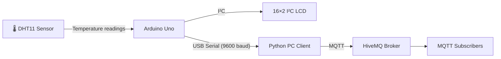
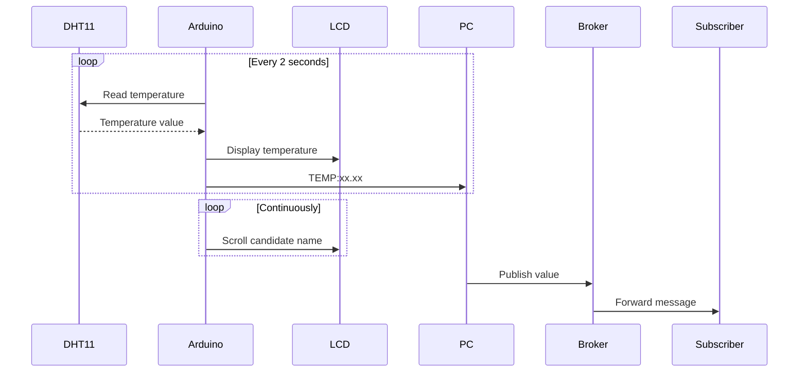

<div align="center">

# 🌡️ IoT Temperature Monitor

**Real-time temperature sensing, LCD display, and MQTT telemetry over the Internet**

[](https://www.arduino.cc/)
[](https://www.python.org/)
[](https://www.hivemq.com/)
[]()

</div>

---

# Overview

This project implements an end-to-end embedded IoT system that:

* Reads temperature from a DHT11 sensor using an Arduino Uno.
* Displays the candidate name and live temperature on a 16×2 I²C LCD.
* Scrolls the candidate name horizontally when it exceeds 16 characters.
* Sends temperature readings to a PC via USB serial communication.
* Uses a Python client to monitor incoming values in real time.
* Publishes temperature readings to an MQTT broker for remote consumption.

---

# Features

* DHT11 temperature acquisition.
* Real-time LCD display.
* Automatic horizontal scrolling for long names.
* USB Serial communication.
* Python monitoring client.
* MQTT publishing.
* Automatic serial port detection.
* Linux and Windows support.

---

# System Architecture



---

# Data Flow



---

# Hardware Components

| Component     | Description              |
| ------------- | ------------------------ |
| Arduino Uno   | Main controller          |
| DHT11 Sensor  | Temperature sensor       |
| 16×2 LCD      | Display module           |
| I²C Interface | LCD communication        |
| USB Cable     | Arduino-PC communication |

---

# Wiring

## DHT11 Connections

| DHT11 Pin | Arduino Uno |
| --------- | ----------- |
| VCC       | 5V          |
| DATA      | D2          |
| GND       | GND         |

## LCD Connections

| LCD Pin | Arduino Uno |
| ------- | ----------- |
| SDA     | A4          |
| SCL     | A5          |
| VCC     | 5V          |
| GND     | GND         |

---

# LCD Layout

```
┌────────────────┐
│ Cyubahiro Don  │
│ Temp: 25.60 C  │
└────────────────┘
```

* Row 1 displays the candidate name.
* Row 2 displays the temperature.
* Names longer than 16 characters automatically scroll horizontally.

---

# Name Scrolling

If the candidate name exceeds the width of the LCD, horizontal scrolling is performed automatically.

Example:

```
Cyubahiro Don D
yubahiro Don Du
ubahiro Don Dur
bahiro Don Durk
...
```

---

# Project Structure

```text
.
├── arduino/
│   └── temp_display.ino
├── pc_client/
│   └── pc_client.py
├── screenshots/
│   ├── lcd_display.jpg
│   ├── serial_monitor.jpg
│   ├── python_client.jpg
│   └── mqtt_dashboard.jpg
├── README.md
└── LICENSE
```

---

# Software Requirements

## Arduino Libraries

Install from Arduino Library Manager:

* DHT Sensor Library (Adafruit)
* Adafruit Unified Sensor
* LiquidCrystal_I2C
* Wire

---

## Python Dependencies

Install with:

```bash
pip install pyserial paho-mqtt
```

---

# Running the System

## Step 1: Upload Arduino Program

Open:

```text
arduino/temp_display.ino
```

Update the candidate name if necessary:

```cpp
String candidateName = "Cyubahiro Don Durkheim";
```

Upload the sketch to the Arduino Uno.

---

## Step 2: Start the PC Client

```bash
python pc_client/pc_client.py
```

Example output:

```text
=== PC Monitoring and MQTT Transmission ===

[11:19:03] Received Temperature: 25.0 °C
[11:19:05] Received Temperature: 25.0 °C
```

---

# Configuration

| Variable      | Default Value              | Description                |
| ------------- | -------------------------- | -------------------------- |
| COM_PORT      | None                       | Automatic port detection   |
| BAUD_RATE     | 9600                       | Serial communication speed |
| READ_INTERVAL | 2000 ms                    | Sensor sampling interval   |
| MQTT_BROKER   | broker.hivemq.com          | MQTT broker                |
| MQTT_PORT     | 1883                       | Broker port                |
| MQTT_TOPIC    | student/sensor/temperature | Publish topic              |

---

# Communication Names

## Serial Communication

| Parameter | Value        |
| --------- | ------------ |
| Interface | USB Serial   |
| Port      | /dev/ttyACM0 |
| Baud Rate | 9600         |
| Format    | TEMP:xx.xx   |

Example:

```text
TEMP:25.60
```

---

## MQTT Communication

| Parameter | Value                      |
| --------- | -------------------------- |
| Protocol  | MQTT                       |
| Broker    | broker.hivemq.com          |
| Port      | 1883                       |
| Topic     | student/sensor/temperature |

---

# Serial Protocol

The Arduino periodically sends data in the format:

```text
TEMP:25.60
```

The Python client:

1. Reads the serial line.
2. Extracts the temperature value.
3. Displays it in real time.
4. Publishes the value to the MQTT broker.

---

# Screenshots

## LCD Display


---

## Serial Monitor


---

## Python Client


---

## MQTT Dashboard


---

# Submission Checklist

* [x] System architecture diagram.
* [x] Temperature sensor reading implemented.
* [x] LCD display implemented.
* [x] Horizontal scrolling implemented.
* [x] Serial communication implemented.
* [x] PC monitoring application implemented.
* [x] MQTT publishing implemented.
* [x] Communication names documented.
* [x] Source code pushed to GitHub.
* [x] Screenshots included.

---

# MQTT Topic

```text
student/sensor/temperature
```

---

# Repository

```text
https://github.com/DonDurkheim/temperature-monitoring-system
```

---

# Author

**Cyubahiro Don Durkheim**

---

# License

MIT License
