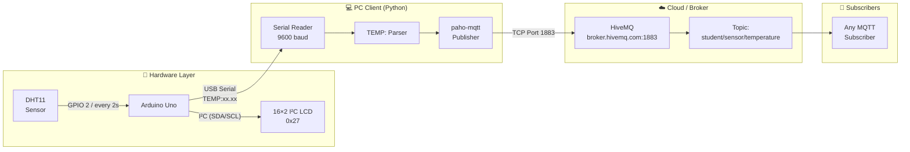
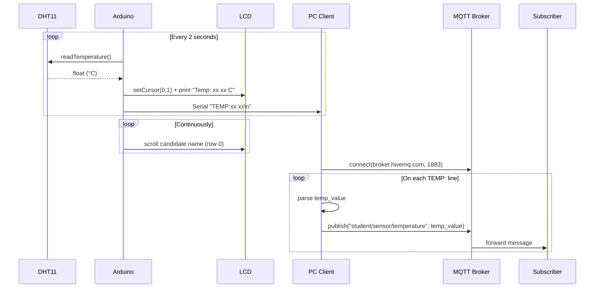

<div align="center">

# 🌡️ IoT Temperature Monitor

**Real-time temperature sensing, local display, and MQTT telemetry over the internet.**

[](https://www.arduino.cc/)
[](https://www.python.org/)
[](https://www.hivemq.com/)
[](LICENSE)
[]()

</div>

---

## Overview

An end-to-end embedded IoT system that reads ambient temperature from a DHT11 sensor, displays the candidate name and live temperature on a 16×2 I²C LCD, streams readings over USB Serial to a PC client, and publishes them to an MQTT broker for remote consumption.

---

## System Architecture



---

## Data Flow



---

## Hardware

| Component | Detail |
|-----------|--------|
| Microcontroller | Arduino Uno |
| Temperature Sensor | DHT11 — data pin **GPIO 2** |
| Display | 16×2 LCD, I²C address `0x27` |
| Communication | USB Serial @ 9600 baud |

### Wiring

```
DHT11  DATA  →  Arduino D2
LCD    SDA   →  Arduino A4
LCD    SCL   →  Arduino A5
LCD    VCC   →  5V
LCD    GND   →  GND
DHT11  VCC   →  3.3V or 5V
DHT11  GND   →  GND
```

---

## Project Structure

```
.
├── arduino/
│   └── temp_display.ino   # Arduino sketch (sensor + LCD + serial output)
├── pc_client/
│   └── pc_client.py       # Python client (serial reader + MQTT publisher)
└── README.md
```

---

## Getting Started

### Arduino

1. Install the following libraries via Arduino Library Manager:
   - `DHT sensor library` by Adafruit
   - `LiquidCrystal_I2C` by Frank de Brabander
   - `Wire` (bundled with Arduino IDE)

2. Open `arduino/temp_display.ino` and update the candidate name if needed:
   ```cpp
   String candidateName = "Cyubahiro Don Durkheim";
   ```

3. Flash to your Arduino Uno.

### PC Client

**Requirements:** Python 3.8+

```bash
pip install pyserial paho-mqtt
```

**Run:**

```bash
python pc_client/pc_client.py
```

The script auto-detects the Arduino port. To pin a specific port, set `COM_PORT` in the script:

```python
COM_PORT = "/dev/ttyACM0"   # Linux
COM_PORT = "COM3"            # Windows
```

---

## Configuration

| Variable | Default | Description |
|----------|---------|-------------|
| `COM_PORT` | `None` | Serial port — `None` enables auto-detect |
| `BAUD_RATE` | `9600` | Must match Arduino sketch |
| `MQTT_BROKER` | `broker.hivemq.com` | Public HiveMQ broker |
| `MQTT_PORT` | `1883` | Standard MQTT port |
| `MQTT_TOPIC` | `student/sensor/temperature` | Topic to publish readings |

---

## Serial Protocol

The Arduino emits a single line per reading over USB Serial:

```
TEMP:25.60
```

The PC client filters for lines starting with `TEMP:`, strips the prefix, and publishes the numeric value to MQTT. Any other serial output is printed as debug info.

---

## LCD Layout

```
┌────────────────┐
│ Cyubahiro Don  │  ← candidate name (scrolls if > 16 chars)
│ Temp: 25.60 C  │  ← live temperature
└────────────────┘
```

---

## License

MIT © Cyubahiro Don Durkheim
